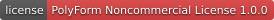
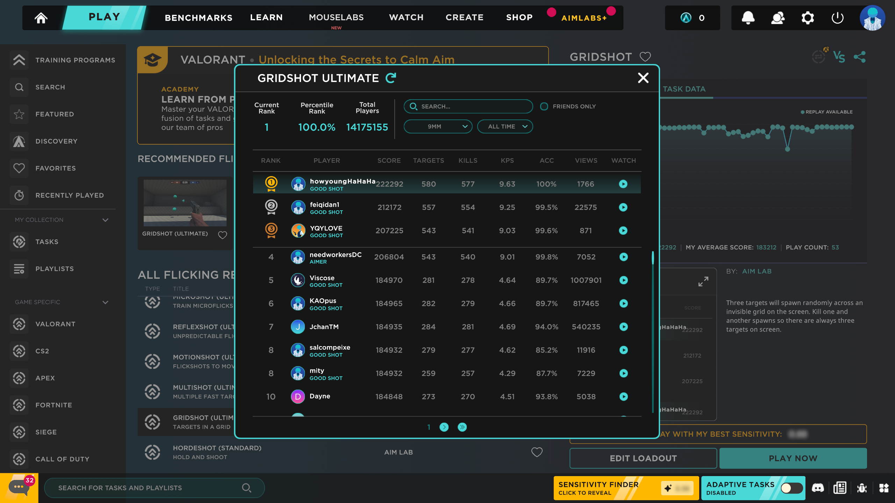
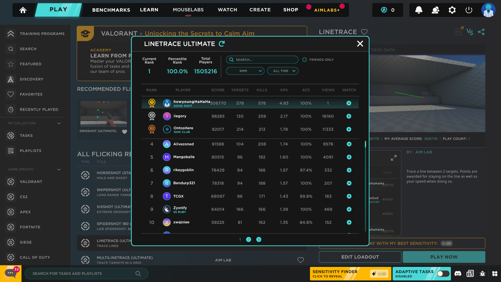
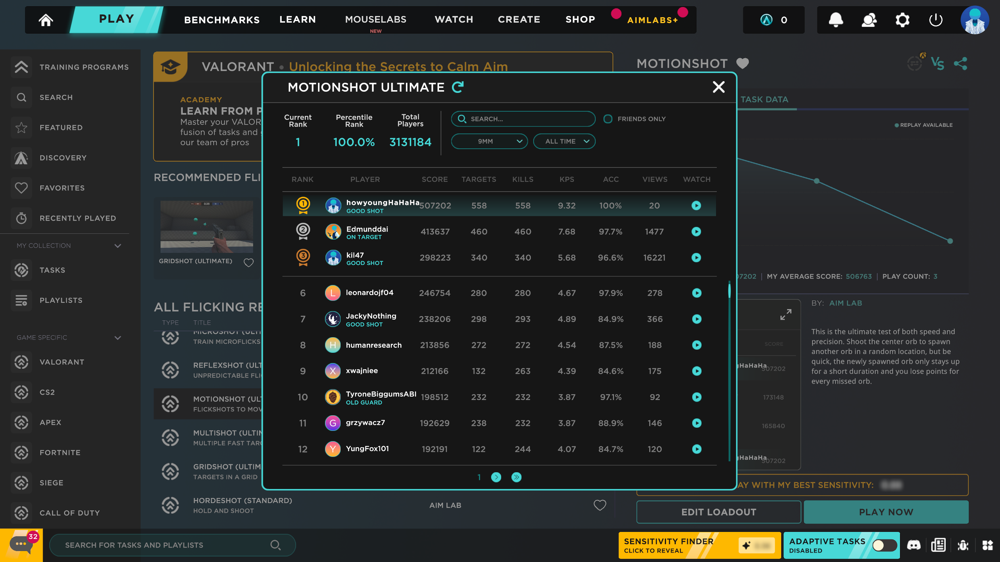
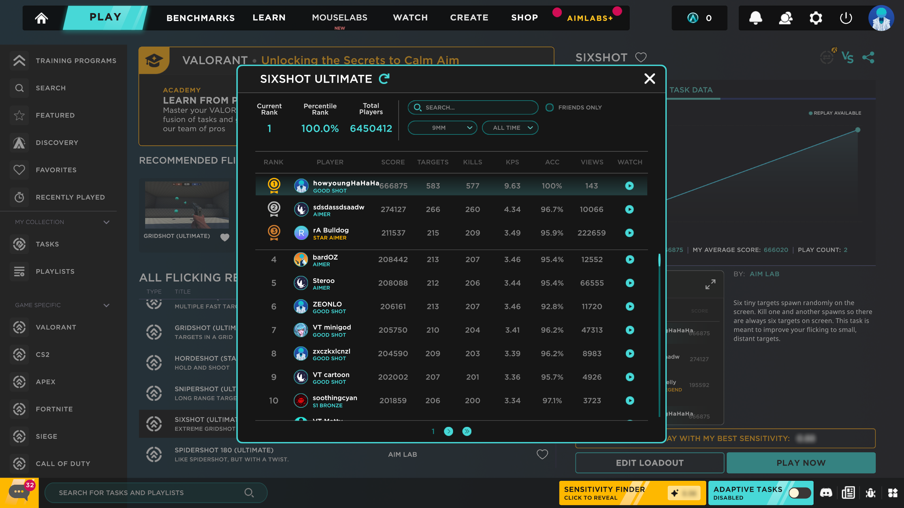
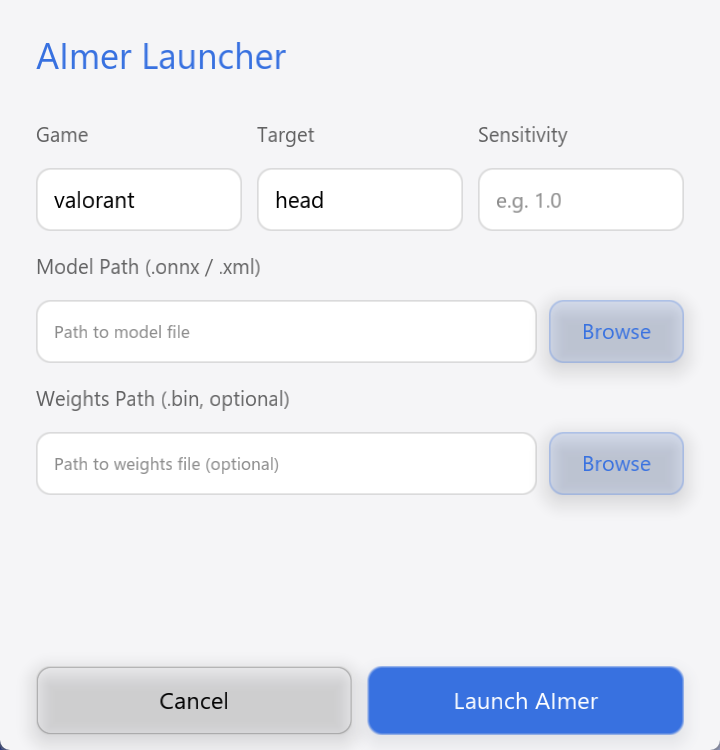
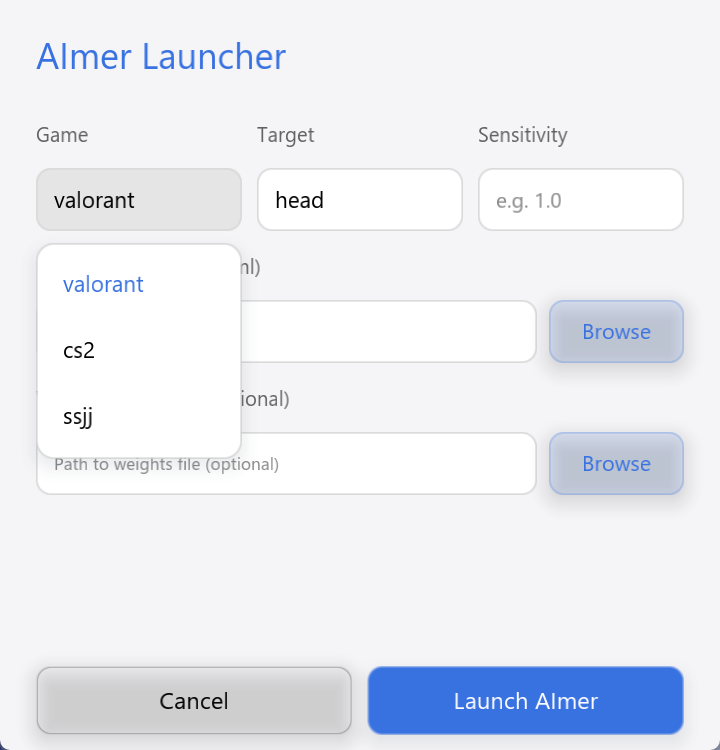

# AImer - 基于计算机视觉目标检测的辅助瞄准学习项目

<div align="center">
  <a href="LICENSE"></a>
 <br>
  
  
  
</div>

<div align="center">
  <a href="readme.md">English</a>
</div>

## 声明

- 本项目一切源码仅供学习使用，可自由修改并应用于离线游戏，但不应用于在线游戏而破坏游戏公平性。

- 本项目的程序在线上游戏存在封号风险，因违规竞技造成的后果需要自行承担。

- 本项目禁止商用，详见[LICENSE](LICENSE)

- 希望各位玩家热爱游戏、尊重对手、珍视账号，共同维护游戏的公平竞技环境。

- ~~作者学业繁重，更新全靠缘分~~

## 简介

**_AImer_** 是一个基于计算机视觉目标检测的辅助瞄准项目，
目前可用于【Aimlabs（仅Gridshot）】，【无畏契约】，【CS2】，【生死狙击】进行辅助瞄准。

## AImer - aimlab

### 程序逻辑

- 屏幕截取：使用`DXGI`截取全屏幕区域。

- 目标检测：使用OpenCV传统视觉方式，根据色相和大小识别浅蓝色小球，而**不使用深度学习**。

- 鼠标控制：使用[IbInputSimulator](https://github.com/Chaoses-Ib/IbInputSimulator)模拟鼠标进行控制。
  根据视场角和游戏灵敏度计算输入实现“一帧拉”，并实现自动开火。

### 推荐设置

| 项目      | 数值        |
|---------|-----------|
| 预设（视场角） | Valorant  |
| 分辨率     | 2560×1440 |
| 画面质量    | Fastest   | 
| 延迟模式    | 极低        | 
| 灵敏度     | 0.1       |
| 输入      | RawInput  | 

> **注意：**
> - 性能设置会影响输入延迟。
> - 不同的视场角会影响鼠标输入的计算结果。
> - 不同灵敏度在相同的模拟输入下未必是理想的倍数关系，如果效果不符合预期，可尝试以上的设置。

其他模式以及不同设置尚未进行测试，如有需要，可联系作者
[hehaoyang1124@outlook.com](mailto:hehaoyang1124@outlook.com)进行适配。

### 战绩（记录已被打破）

|       |    |    |
|---------------------------------------|---------------------------------------|---------------------------------------|
|  |    |  |
|        |  |  |

---

## AImer - DL

### 关于性能

#### OpenVINO （CPU推理）
- 最新的 **_AImer_** 更新了ir模型。新模型基于yolo目标检测开发，替换主干网络为更加轻量化的MobileNetV4。

- 新模型使用 OpenVINO 部署，纯CPU推理，可适用于无NVIDIA显卡的设备，
  也可以避免占用显卡渲染游戏的计算资源，用少量精度的下降换取更高的推理帧率。

#### ONNX Runtime （NVIDIA显卡CUDA加速推理）

- 基于yolo目标检测的模型，使用ONNX Runtime进行推理， 可以在NVIDIA显卡上使用CUDA加速推理，提高推理帧率。

- 相比MobileNetV4，原DarkNet的主干网络精度更高，但在显卡加速推理会与游戏渲染竞争计算资源，导致帧率较低，
  实际推理帧数与设备性能有关。

> **注意：** 推理帧数过高不总是好事，当推理比弹道回正速度快时，程序会自动压镜头，导致连续空枪。
> 您可以在`autoAim.cpp`中注释自动开火，自己把握射击的主动权（已经默认关闭自动开火）。

### 程序逻辑

- 屏幕截取：使用`DXGI`来抓取屏幕中间 640×640 的区域。

- 目标检测：基于`yolo`目标检测训练的模型，导出为 onnx / ir 模型，并使用 ONNX Runtime/OpenVINO 进行推理。

- 鼠标控制：使用[IbInputSimulator](https://github.com/Chaoses-Ib/IbInputSimulator)模拟鼠标进行控制。
  在目标靠近准星时使用吸附模式进行微调，在远距离时直接计算鼠标输入实现“一帧拉”

### 适配情况

1. 本项目的目标平台为`windows 11`，其他`windows`版本未进行测试。

2. 本项目模拟罗技鼠标（见[安装依赖](#安装依赖)），屏幕分辨率为$2560\times 1440$，截取为屏幕中心$640\times640$。
    - 模拟不同鼠标驱动默认灵敏度可能会有所差异。
    - 不同分辨率下截屏的视场角可能有所差异。

3. 目前适配的游戏及推荐设置如下
 
   | 启动名称     | 游戏   | 鼠标灵敏度     | 垂直同步 |
   |----------|------|-----------|------|
   | valorant | 无畏契约 | 0.1       | 关    |
   | cs2      | CS2  | 1.0       | 关    |
   | ssjj     | 生死狙击 | 10，关闭鼠标平滑 | 开    |

    > **注意：**
    > - 不同灵敏度在相同的模拟输入下未必是理想的倍数关系，如果效果不符合预期，可尝试以上的设置
    > - 不同游戏引擎对于鼠标输入的处理策略不同，如若准星在目标附近晃动，可尝试开启/关闭垂直同步

4. 目前支持的目标检测类别
 
   | 启动名称     | 游戏   | 类别 0      | 类别 1           | 类别 2    | 类别 3         |
   |----------|------|-----------|----------------|---------|--------------|
   | valorant | 无畏契约 | 头部(head)  | 全身(enemy)      | -       | -            |
   | cs2      | CS2  | CT 全身(ct) | CT 头部(ct_head) | T 全身(t) | T 头部(t_head) |
   | ssjj     | 生死狙击 | CT 全身(ct) | CT 头部(ct_head) | T 全身(t) | T 头部(t_head) |
 
5. 自定义游戏支持的模型
    - 所有的游戏支持都从[games.yaml](games.yaml)中读取，您可以自行修改该文件以添加适用于其他游戏的设置。
    - 您可以使用自己的模型（目前仅支持后处理YOLO-detect系列的输出网络），target的次序应和模型目标分类一致。
    - 其他游戏以及不同配置尚未进行测试，如有需要，可联系作者[hehaoyang1124@outlook.com](mailto:hehaoyang1124@outlook.com)进行适配。

## 开始游戏

### 安装依赖

- 您需要安装[NVIDIA显卡驱动程序](https://www.nvidia.cn/geforce/drivers/)，
  以便使用[CUDA Toolkit](https://developer.nvidia.com/cuda/toolkit)，[CUDNN](https://developer.nvidia.com/cudnn)进行推理加速
- 您需要鼠标驱动进行模拟鼠标，否则将退为Send Input，可能被大部分反作弊的游戏过滤掉
  - 简单地说，您可以直接安装[Logitech Gaming Software v9.02.65](https://github.com/Chaoses-Ib/IbLogiSoftExt/releases/download/v0.1/LGS.v9.02.65_x64.exe)
  - 如无法加载驱动程序，需[关闭内存完整性保护](https://support.microsoft.com/en-us/windows/a-driver-can-t-load-on-this-device-8eea34e5-ff4b-16ec-870d-61a4a43b3dd5)
  - 更多驱动，详见[IbInputSimulator](https://github.com/Chaoses-Ib/IbInputSimulator)。

### 启动程序

#### 1. 从Launcher界面启动

- 直接点击AImer.exe或无其他参数执行AImer.exe即可打开如图Launcher窗口。
- 从下拉列表中选择游戏、识别目标、鼠标灵敏度（游戏内灵敏度）。
- 选择适用于识别目标的模型文件、权重文件（可选，根据权重有无分别使用ONNX Runtime/OpenVINO推理）。
- 点击【Launch AImer】按钮启动程序。

|                                    |                                              |                                                  |
|------------------------------------|----------------------------------------------|--------------------------------------------------|
|  |  |  |

#### 2. 从命令行启动
启动命令帮助如下
``` bash
Usage: AImer.exe [OPTIONS]
Options:
  -h,--help                            Print this help message and exit
  -n,--name TEXT REQUIRED              Game name (valorant|cs2|ssjj)
  -t,--target TEXT REQUIRED            Target name (e.g. head, enemy, ct, t)
  -s,--sensitivity FLOAT REQUIRED      Mouse sensitivity
  -m,--model TEXT:FILE REQUIRED        Model path (.xml/.onnx)
  -w,--weights TEXT:FILE               Weights path (.bin), use OpenVINO when provided
```

- 启动命令为 `AImer.exe -n <游戏名称> -t <目标类别> -s <游戏内灵敏度> -m <模型文件> -w <权重文件（可选）>`
- 游戏名称，目标类别见[适配情况](#适配情况)表格。
- 权重文件为可选参数
    - 使用权重文件表示使用OpenVINO（使用CPU）推理。
    - 不使用权重文件使用onnxRuntime（默认使用NVIDIA显卡CUDA加速）推理
- 例如：`AImer.exe -n valorant -t head -s 0.1 -m ../models/valorant-bot.onnx`
    - 表示启动【无畏契约】，
    - 目标类别为【头部】，
    - 游戏内灵敏度为0.1，
    - 模型文件为`../models/valorant-bot.onnx`，
    - 无权重文件，使用NVIDIA显卡进行推理。
- ~~以上参数适配原代码，大佬们尽可按需魔改~~

## 构建运行

如果您想要修改源码、或自行编译运行。

准备工具：[CMake](https://cmake.org/download/)，
[Visual Studio](https://visualstudio.microsoft.com/zh-hans/downloads/)，
[OpenCV](https://opencv.org/releases/)，
[CUDNN](https://developer.nvidia.com/cudnn)
[ONNX Runtime](https://onnxruntime.ai/)
[OpenVINO](https://openvinotoolkit.org/)

1. 克隆仓库和子模块
    ``` powershell
    git clone https://github.com/HeHaoyang1124/AImer
    git submodule update --init --recursive
    ```
2. 配置和编译
    ``` powershell
    mkdir build
    cd build
    
    cmake `
    -DOpenCV_DIR=path/to/OpenCV `
    -DCUDNN_LIB_DIR=Path/to/CUDNN/xxx/lib/xxx/x64 `
    -DOpenVINO_DIR=path/to/OpenVINO ..
   
    cmake --build . --config Release
    ```
3. 配置和编译
    ```
    # 运行 AImer-DL
    ..\bin\Release\AImer.exe `
    -n valorant -t head -s 0.1 `
    -m ..\models\valorant\valorant-bot.xml `
    -w ..\models\valorant\valorant-bot.bin
    # 或者直接运行 AImer.exe 启动Launcher界面
    
    # 运行 AImer-aimlab
    ..\bin\Release\AImer-aimlab.exe -s 0.1
    ```